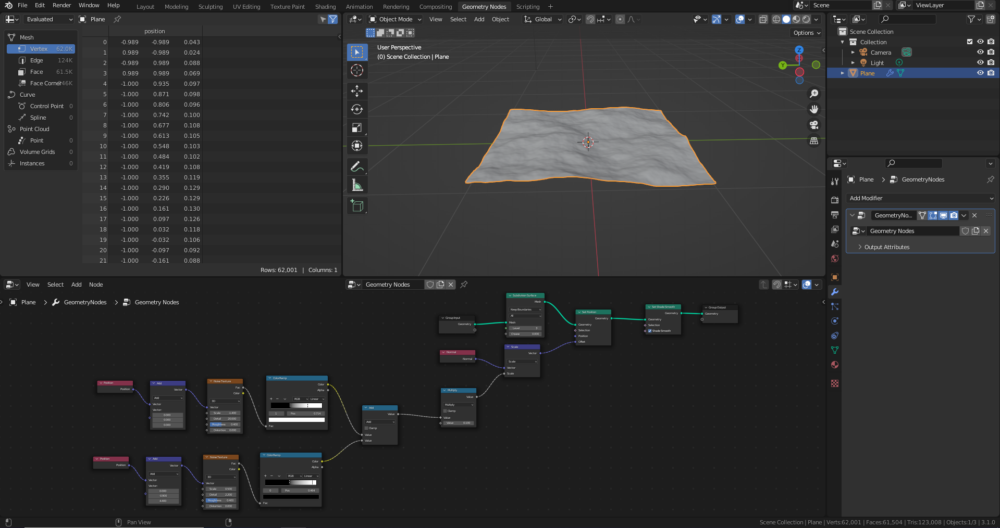

# DEV-02, Terrain Practice Again
### Tags: [geometry nodes]
### Link:[<https://academy.cgboost.com/courses/master-3d-environments-in-blender/lectures/37738867>,<https://academy.cgboost.com/courses/master-3d-environments-in-blender/lectures/37738871>]

## Terrain

## Dirt

## Lighting

